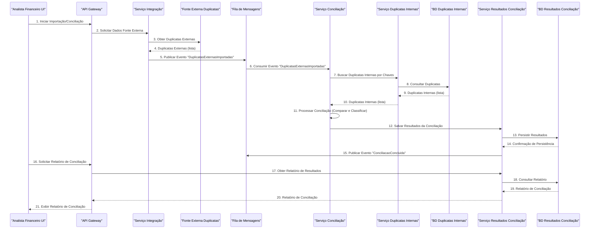

# Diagrama de Sequência

Gerado automaticamente em: 2026-01-13T19:12:42.419265200

```mermaid
sequenceDiagram
    participant AnalistaUI as "Analista Financeiro UI"
    participant ApiGw as "API Gateway"
    participant ServicoIntegracao as "Serviço Integração"
    participant FonteExterna as "Fonte Externa Duplicatas"
    participant Mensageria as "Fila de Mensagens"
    participant ServicoConciliacao as "Serviço Conciliação"
    participant ServicoDuplicatas as "Serviço Duplicatas Internas"
    participant DBDuplicatas as "BD Duplicatas Internas"
    participant ServicoResultados as "Serviço Resultados Conciliação"
    participant DBResultados as "BD Resultados Conciliação"

    AnalistaUI->>ApiGw: 1. Iniciar Importação/Conciliação
    ApiGw->>ServicoIntegracao: 2. Solicitar Dados Fonte Externa
    ServicoIntegracao->>FonteExterna: 3. Obter Duplicatas Externas
    FonteExterna-->>ServicoIntegracao: 4. Duplicatas Externas (lista)
    ServicoIntegracao->>Mensageria: 5. Publicar Evento "DuplicatasExternasImportadas"
    Mensageria->>ServicoConciliacao: 6. Consumir Evento "DuplicatasExternasImportadas"
    ServicoConciliacao->>ServicoDuplicatas: 7. Buscar Duplicatas Internas por Chaves
    ServicoDuplicatas->>DBDuplicatas: 8. Consultar Duplicatas
    DBDuplicatas-->>ServicoDuplicatas: 9. Duplicatas Internas (lista)
    ServicoDuplicatas-->>ServicoConciliacao: 10. Duplicatas Internas (lista)
    ServicoConciliacao->>ServicoConciliacao: 11. Processar Conciliação (Comparar e Classificar)
    ServicoConciliacao->>ServicoResultados: 12. Salvar Resultados da Conciliação
    ServicoResultados->>DBResultados: 13. Persistir Resultados
    DBResultados-->>ServicoResultados: 14. Confirmação de Persistência
    ServicoResultados->>Mensageria: 15. Publicar Evento "ConciliacaoConcluida"

    AnalistaUI->>ApiGw: 16. Solicitar Relatório de Conciliação
    ApiGw->>ServicoResultados: 17. Obter Relatório de Resultados
    ServicoResultados->>DBResultados: 18. Consultar Relatório
    DBResultados-->>ServicoResultados: 19. Relatório de Conciliação
    ServicoResultados-->>ApiGw: 20. Relatório de Conciliação
    ApiGw-->>AnalistaUI: 21. Exibir Relatório de Conciliação
```
