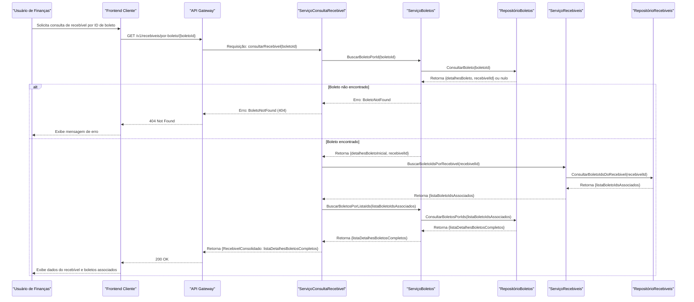

# Diagrama de Sequência

Gerado automaticamente em: 2026-01-14T08:17:53.772397500

```mermaid
sequenceDiagram
    participant Usuario as "Usuário de Finanças"
    participant Client as "Frontend Cliente"
    participant ApiGateway as "API Gateway"
    participant ServicoConsulta as "ServiçoConsultaRecebivel"
    participant ServicoBoleto as "ServiçoBoletos"
    participant RepoBoleto as "RepositórioBoletos"
    participant ServicoRecebivel as "ServiçoRecebiveis"
    participant RepoRecebivel as "RepositórioRecebiveis"

    Usuario->>Client: Solicita consulta de recebível por ID de boleto
    Client->>ApiGateway: GET /v1/recebiveis/por-boleto/{boletoId}
    ApiGateway->>ServicoConsulta: Requisição: consultarRecebivel(boletoId)

    ServicoConsulta->>ServicoBoleto: BuscarBoletoPorId(boletoId)
    ServicoBoleto->>RepoBoleto: ConsultarBoleto(boletoId)
    RepoBoleto-->>ServicoBoleto: Retorna {detalhesBoleto, recebivelId} ou nulo

    alt Boleto não encontrado
        ServicoBoleto-->>ServicoConsulta: Erro: BoletoNotFound
        ServicoConsulta-->>ApiGateway: Erro: BoletoNotFound (404)
        ApiGateway-->>Client: 404 Not Found
        Client-->>Usuario: Exibe mensagem de erro
    else Boleto encontrado
        ServicoBoleto-->>ServicoConsulta: Retorna {detalhesBoletoInicial, recebivelId}

        ServicoConsulta->>ServicoRecebivel: BuscarBoletoIdsPorRecebivel(recebivelId)
        ServicoRecebivel->>RepoRecebivel: ConsultarBoletoIdsDoRecebivel(recebivelId)
        RepoRecebivel-->>ServicoRecebivel: Retorna {listaBoletoIdsAssociados}
        ServicoRecebivel-->>ServicoConsulta: Retorna {listaBoletoIdsAssociados}

        ServicoConsulta->>ServicoBoleto: BuscarBoletosPorListaIds(listaBoletoIdsAssociados)
        ServicoBoleto->>RepoBoleto: ConsultarBoletosPorIds(listaBoletoIdsAssociados)
        RepoBoleto-->>ServicoBoleto: Retorna {listaDetalhesBoletosCompletos}
        ServicoBoleto-->>ServicoConsulta: Retorna {listaDetalhesBoletosCompletos}

        ServicoConsulta-->>ApiGateway: Retorna {RecebivelConsolidado: listaDetalhesBoletosCompletos}
        ApiGateway-->>Client: 200 OK
        Client-->>Usuario: Exibe dados do recebível e boletos associados
    end
```
